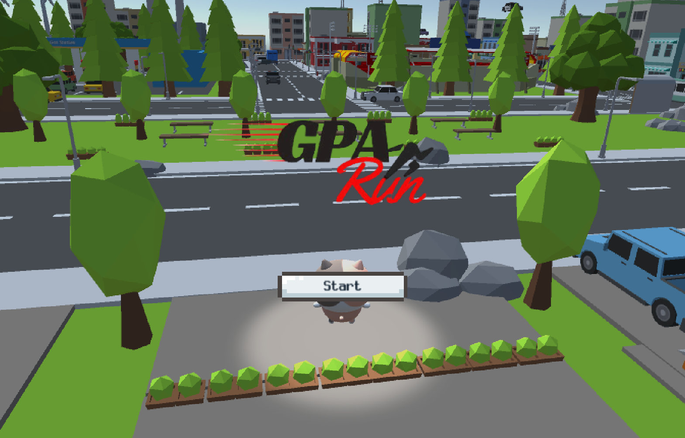

#  GPA-Run: Unity 3D 통학 시뮬레이션 게임

---

## 📝 프로젝트 소개

> GPA-Run은 바쁜 대학생들의 통학 경험을 유쾌하게 풀어낸 캐주얼 3D 러닝 게임입니다. 플레이어는 정해진 시간 내에 버스 정류장까지 달려가면서, 시간 관리의 중요성과 함께 도전 욕구를 느낄 수 있습니다. 단순히 달리기만 하는 게임이 아니라, 버스 시간 체크, 차량 피하기 등 현실적인 요소를 게임에 접목하여 몰입도를 높였습니다.

---

## 🕹️ 게임 플레이

-   **게임 목표**: 정해진 시간 내에 버스 정류장에 도착하여 출석에 성공하는 것입니다.
-   **라운드 시스템**: 게임은 총 3라운드로 구성되며, 각 라운드마다 3개의 하트가 주어집니다. 하트를 모두 소진하지 않고 완주하면 출석으로 인정됩니다.
-   **난이도**: 라운드마다 버스 정류장의 위치가 무작위로 변경되어 난이도가 고정되지 않도록 구성했습니다.
-   **최종 결과**: 3라운드의 누적 결과(남은 하트 개수)에 따라 A+부터 F까지 최종 등급이 결정됩니다.

---

## ⚙️ 조작법

| 키                | 기능                                                 |
| ----------------- | ---------------------------------------------------- |
| `WASD` 또는 `방향키` | 3인칭 카메라 방향을 기준으로 이동합니다.               |
| `W` 또는 `↑` 더블 탭 | 달리기 모드가 활성화되어 이동 속도가 2배 빨라집니다. |
| `스페이스바`      | 점프합니다.                                          |
| `Q` 키            | 게임 중 시작 지점으로 즉시 리스폰됩니다.             |

---

## 🛠️ 개발 환경 및 기술

-   **게임 엔진**: Unity 2018.3.0f2 LTS
-   **개발 환경**: Visual Studio 2022 Community
-   **주요 기능 구현**:
    -   **UI/UX**: 타이머, 하트, 방향 화살표 등 UI를 통해 플레이어에게 게임 정보를 실시간으로 제공합니다.
    -   **그래픽**: 에셋 스토어에서 다운로드한 `LittleFriends` (캐릭터)와 `SimplePoly City` (맵) 에셋을 활용하여 3D 환경을 구축했습니다.
    -   **사운드**: BGM과 효과음을 활용하여 게임의 분위기를 조성하고 몰입감을 높였습니다.
    -   **오브젝트 상호작용**: `Rigidbody` 및 `Collider`를 이용해 캐릭터와 차량 간의 충돌을 처리하고, 플레이어 리스폰 시스템을 구현했습니다.

---

## 🚧 개발 과정 중의 문제 해결

1.  **오브젝트 충돌 문제**: 캐릭터가 벽이나 차량을 통과하는 오류는 `Rigidbody`와 `Collider` 컴포넌트를 추가하여 해결했습니다.
2.  **UI 이미지 오류**: UI 이미지가 적용되지 않던 문제는 이미지의 **Texture Type**을 **Sprite**로 변경하여 해결했습니다.
3.  **버튼 이벤트 미작동**: 버튼 클릭 이벤트가 실행되지 않는 오류는 실수로 삭제한 `Event System` 오브젝트를 다시 추가하여 해결했습니다.
4.  **원격 브랜치 삭제 오류**: GitHub의 기본 브랜치(default branch)를 삭제하려는 오류는 웹사이트에서 다른 브랜치를 기본값으로 설정한 뒤 해결했습니다.

---

## 👏 개발 후기

이 프로젝트는 Unity 엔진의 핵심 기술들을 배우고 실제 게임에 적용해 볼 수 있었던 소중한 경험이었습니다. 비록 모든 기능을 구현하지는 못했지만, 다양한 기술적 문제를 해결하며 게임 개발의 기초를 다질 수 있었습니다.
